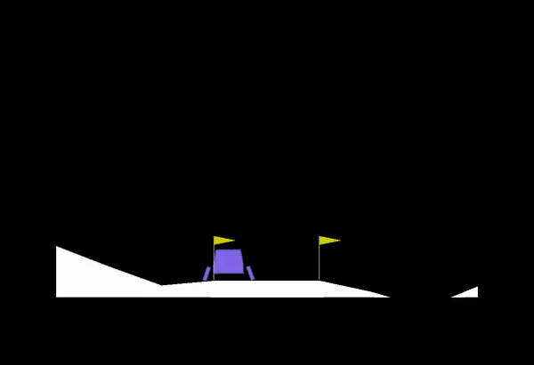

# Deep Deterministic Policy Gradients

Pytorch implementation of the Deep Deterministic Policy Gradients Algorithm for Continuous Control as described by the paper [Continuous control with deep reinforcement learning](https://arxiv.org/abs/1509.02971) by Timothy P. Lillicrap, Jonathan J. Hunt, Alexander Pritzel, Nicolas Heess, Tom Erez, Yuval Tassa, David Silver, Daan Wierstra.

## Results

### BipedalWalker-V3

**Environment Link:** [https://gym.openai.com/envs/BipedalWalker-v2/](https://gym.openai.com/envs/BipedalWalker-v2/)

**Mean Reward:** `169.5047038212551` sampled over `20` evaluation episodes.

Experiment Conducted on **Free-P5000** instance provided by [Paperspace Gradient](gradient.paperspace.com).


### LunarLanderContinuous-V2

**Mean Environment Link:** [https://gym.openai.com/envs/LunarLanderContinuous-v2/](https://gym.openai.com/envs/LunarLanderContinuous-v2/)

**Reward:** `277.938417002226` sampled over `20` evaluation episodes.

Experiment Conducted on **Free-P5000** instance provided by [Paperspace Gradient](gradient.paperspace.com).



## Reference

```
@misc{1509.02971,
    Author = {Timothy P. Lillicrap and Jonathan J. Hunt and Alexander Pritzel and Nicolas Heess and Tom Erez and Yuval Tassa and David Silver and Daan Wierstra},
    Title = {Continuous control with deep reinforcement learning},
    Year = {2015},
    Eprint = {arXiv:1509.02971},
}
```